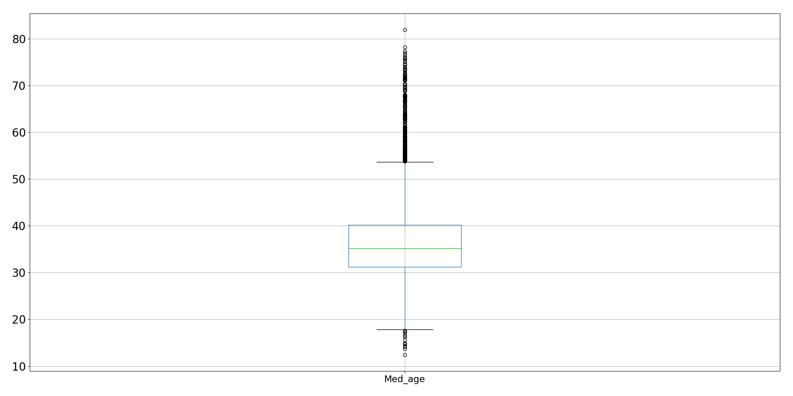
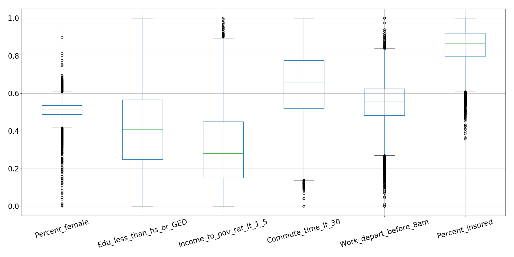
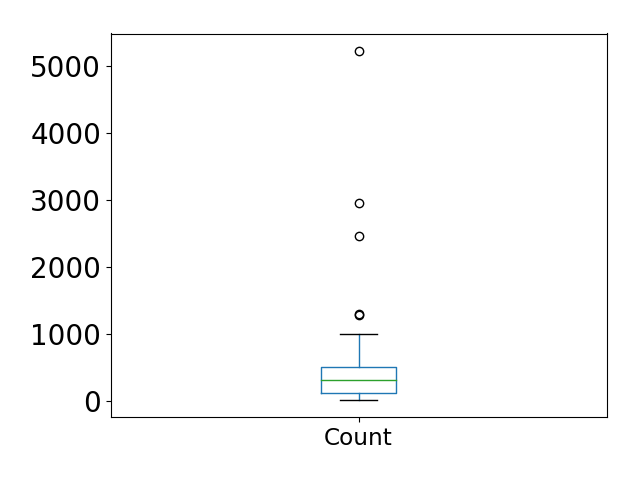
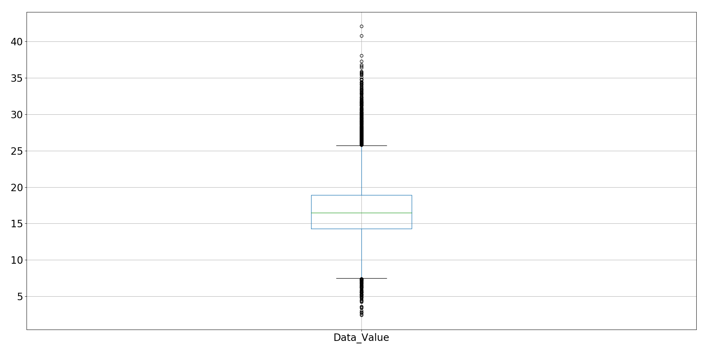

# Predicting Bad Habits: US Census Bureau
Capstone 1 for Galvanize Data Immersive

By Danny Lumian, PhD

October, 2018

## Question

    Bad habits (i.e., binge-drinking, smoking and sleeping <7 hrs a night) can 
    significantly impact personal well-being and may put an increased burden on society 
    (e.g., by increasing health-care costs). 
    Therefore it is important to understand factors that contribute to bad habits 
    or, conversely, what predicts healthy living. 

    Can I predict these bad habits by demographic variables such as age, gender and education?

## The Data

    500 Cities: 
    The Center for Disease Control collected data from 500 cities (https://www.cdc.gov/500cities/) 
    across the US broken down by census tract (~28,000) on disease risk factors, health outcomes and preventive services. 
    The disease risk factors, or bad habits, are binge-drinking, smoking and sleeping < 7 hrs a night and 
    were collected in 2015. 
    I plan to first explore binge-drinking, but hope to extend analyses to examine all three outcomes. 

    American Community Survey-5 year estimates(ACS5): The US Census Bureau collected 5 year estimates on demographic variables 
    (https://www.census.gov/programs-surveys/acs/technical-documentation/table-and-geography-changes/2015/5-year.html) 
    accessible by census tract ID (for joining with 500 Cities data). 
    This dataset includes 1000s of variables (see: https://api.census.gov/data/2015/acs5/variables.html). 
    From these I would like to start by pulling variables on population size, age, gender, income, education 
    and insurance coverage as predictors of bad habits. 

## MVP
    1. Combine data from 500 Cities and the ACS5 by census tract to yield data on 25,000+ geographic regions.
    2. Explore demographic predictors of binge-drinking (EDA). 
    3. Conduct regression analyses to quantify the relative contributions of these factors to binge-drinking.

### ACS5 Demographic Variables

#### Total Sample Size

|   Initial |   Final |   Dropped |   Dropped % |
|----------:|--------:|----------:|------------:|
|     28004 |   27141 |       863 |       0.031 |

#### Median Age

#### Demographic Variables

#### State Variables (Categorical)

### Binge Drinking

## MVP+, MVP++, MVP+++
    1. Expand analyses to include other bad behaviors (i.e., smoking and sleeping < 7 hrs a night).
    2. Include other predictors of interest from the ACS5. Candidates include commute time and work start time.
    3. Include data from additional sources to explore non-demographic contributors to bad habits. 
        Data can be organized by geolocation (longitude, latitude) so data from non-Census sources could be included. 
        Candidates include weather and social  media use (e.g., Twitter posts). 