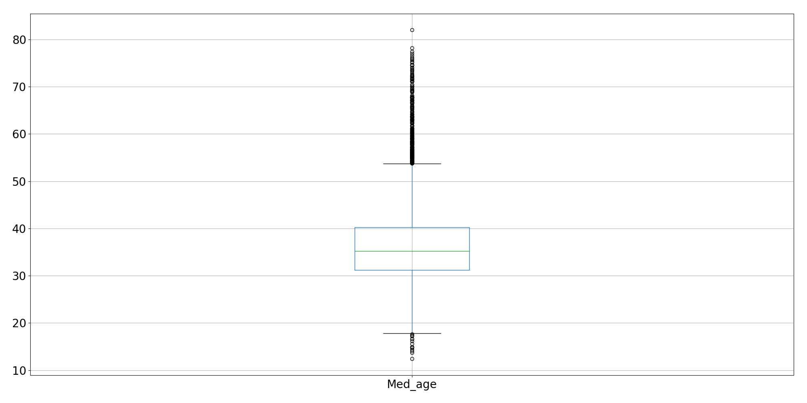
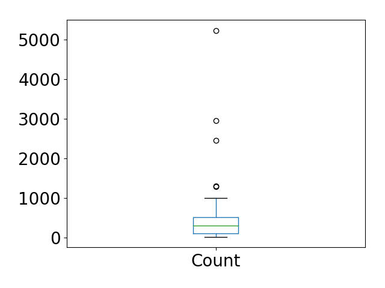

# Predicting Bad Habits: US Census Bureau
Capstone 1 for Galvanize Data Immersive

By Danny Lumian, PhD

October, 2018

## Question
    
    Bad habits (i.e., binge-drinking, smoking and sleeping <7 hrs a night) can 
    significantly impact personal well-being and put an increased burden on society 
    (e.g., by increasing health-care costs, impaired working). 
    Therefore it is important to understand factors that contribute to bad habits 
    or, conversely, what predicts healthy living. 

     The National Institute on Alcohol Abuse and Alcoholism defines binge drinking as a pattern of drinking that 
     brings a person’s blood alcohol concentration (BAC) to 0.08 grams percent or above. 
     This typically happens when men consume 5 or more drinks or 
     women consume 4 or more drinks in about 2 hours. 
     Most people who binge drink are not alcohol dependent. 
     (From https://www.cdc.gov/alcohol/fact-sheets/binge-drinking.htm)

## The Data

    500 Cities: 
    The Center for Disease Control collected data from 500 cities (https://www.cdc.gov/500cities/) 
    across the US broken down by census tract (~28,000) on disease risk factors, health outcomes and preventive services. 
    The disease risk factors, or bad habits, are binge-drinking, smoking and sleeping < 7 hrs a night and 
    were collected in 2015. 
    I plan to first explore binge-drinking, but hope to extend analyses to examine all three outcomes. 

    American Community Survey-5 year estimates(ACS5): 
    The US Census Bureau collected 5 year estimates on demographic variables 
    (https://www.census.gov/programs-surveys/acs/technical-documentation/table-and-geography-changes/2015/5-year.html) 
    accessible by census tract ID (for joining with 500 Cities data). 
    This dataset includes 1000s of variables (see: https://api.census.gov/data/2015/acs5/variables.html). 
    From these I would like to start by pulling variables on population size, age, gender, income, education 
    and insurance coverage as predictors of bad habits. 

## MVP
    1. Combine data from 500 Cities and the ACS5 by census tract to yield data on 25,000+ geographic regions.
    2. Explore demographic predictors of binge-drinking (EDA). 
    3. Conduct regression analyses to quantify the relative contributions of these factors to binge-drinking.

### ACS5 Demographic Variables

#### Total Sample Size

|   Initial |   Final |   Dropped |   Dropped % |
|----------:|--------:|----------:|------------:|
|     28004 |   27141 |       863 |       3.082 |


#### Median Age



#### Demographic Variables


#### State Variables (Categorical)



### Binge Drinking


## Hypotheses 

    0. The base rate of binge drinking will be above 0 (intercept>0).
    1. As the median age <b>increases</b>,
        the % of the population that binge drinks will <b>decrease</b>.
    2. As the % of the population that is female <b>increases</b>, 
        the % of the population that binge drinks will <b>decrease</b>.
    3. As the % of the population with less than a high school education <b>increases</b>,
        the % of the population that binge drinks will <b>increase</b>. 
    4. As the % of the population with an income to poverty ratio of less than 1.5 <b>increases</b>,
        the % of the population that binge drinks will <b>decrease</b>.
    5. As the % of the population with a commute less than 30 minutes <b>increases</b>,
        the % of the population that binge drinks will <b>increase</b>.  
    6. As the % of the population that departs for work before 8am <b>increases</b>,
        the % of the population that binge drinks will <b>decrease</b>.
    7. As the % of the population with insurance <b>increases</b>,
        the % of the population that binge drinks will <b>decrease</b>.
    8. State will be associated with binge drinking,
        no directional hypotheses.   

<!---
#### Goldfeldquandt Test
```python
all_cols = list(df.columns)
all_cols.remove('Data_Value')
all_columns = "+".join(all_cols)
my_formula = "y~" + all_columns
results1 = smf.ols(my_formula, data=df).fit()
print(results1.summary2())

f_stat, p_val, inc_dec = het_goldfeldquandt(results1.resid, results1.model.exog)
print(f'For model 1 het goldfeldquandt test, the f stat is {f_stat} and the p value is {p_val}')
```
For model 1 het goldfeldquandt test, the f stat is 0.855 and the p value is 0.999

#### Variance Inflation Factors
```python
vif_df = add_constant(df.drop(['Data_Value'], axis=1))
vifs = pd.Series([variance_inflation_factor(vif_df.values, i) 
               for i in range(vif_df.shape[1])], 
              index=vif_df.columns)
```
|   count |   mean |    std |   min |   25% |   50% |   75% |     max |
|--------:|-------:|-------:|------:|------:|------:|------:|--------:|
|      58 |  9.852 | 61.175 | 1.018 | 1.194 | 1.476 | 1.868 | 467.641 |

    * Note: Constant has VIF of 467.641, next highest value is CA at 7.16

### Comparing Models

| Model            |       alpha |   test_mean_rmse |   test_r2 |   train_mean_rmse |
|:-----------------|------------:|-----------------:|----------:|------------------:|
| LinearRegression |             |            2.189 |     0.68  |             2.159 |
| Lasso            | 0.00431261  |            2.222 |     0.666 |             2.198 |
| Ridge            | 0.120338    |            2.189 |     0.68  |             2.159 |
| ElasticNet       | 0.00862522  |            2.374 |     0.62  |             2.348 |
| LassoLars        | 3.04196e-06 |            2.189 |     0.68  |             2.159 |
    
    * Note: Ridge performed best (marginally better than Linear and LassoLars)
    * For simplicties sake and since performance was comparable, interpreting linear regression
-->
#### Linear Regression Analysis

    57 Predictors + an intercept in model
    50 Categorical state predictors
        CO was baseline
        DC was included
    7 Demographic variables shown above


|   Intercept |   Percent female |   IPR < 1.5 |   Edu < HS/GED |   Percent insured |   Work depart before 8am |   Med_age |   Commute time < 30m |
|------------:|-----------------:|---------------------------:|--------------------------:|------------------:|-------------------------:|----------:|---------------------:|
|     42.9877 |         -16.9848 |                   -10.0258 |                  -6.59758 |          -4.20619 |                -0.767881 |  -0.24437 |             0.981684 |

### Choropleth map


## Hypotheses Results

    0. The base rate of binge drinking will be above 0 (intercept>0).
        -Intercept was ~43%
    1. As the median age <b>increases</b>,
        the % of the population that binge drinks will <b>decrease</b>.
        -Coef was -0.24437
    2. As the % of the population that is female <b>increases</b>, 
        the % of the population that binge drinks will <b>decrease</b>.
        -Coef was -16.9848
    <strike>3. As the % of the population with less than a high school education <b>increases</b>,
        the % of the population that binge drinks will <b>increase</b>.</strike>
        -Coef was -6.59758
    4. As the % of the population with an income to poverty ratio of less than 1.5 <b>increases</b>,
        the % of the population that binge drinks will <b>decrease</b>.
    5. As the % of the population with a commute less than 30 minutes <b>increases</b>,
        the % of the population that binge drinks will <b>increase</b>.  
    6. As the % of the population that departs for work before 8am <b>increases</b>,
        the % of the population that binge drinks will <b>decrease</b>.
    7. As the % of the population with insurance <b>increases</b>,
        the % of the population that binge drinks will <b>decrease</b>.
    8. State will be associated with binge drinking,
        no directional hypotheses.   

## MVP+, MVP++, MVP+++
    1. Expand analyses to include other bad behaviors (i.e., smoking and sleeping < 7 hrs a night).
    2. Include data from additional sources to explore non-demographic contributors to bad habits. 
        Data can be organized by geolocation (longitude, latitude) so data from non-Census sources could be included. 
        Candidates include weather and social  media use (e.g., Twitter posts). 