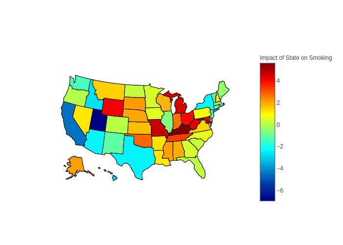

# Predicting Bad Habits: US Census Bureau
Capstone 1 for Galvanize Data Science Immersive

By Danny Lumian, PhD

October, 2018

## Question
    
Bad habits (i.e., binge-drinking, smoking and sleeping <7 hrs a night) 
significantly impact personal well-being and put an increased burden on society 
(e.g., by increasing health-care costs, impaired working). 
Therefore it is important to understand factors contribute to bad habits 
or, conversely, what predicts healthy living. 

Can demographic variables, such as gender, age and geographical location, predict bad habits?

## The Data

### 500 Cities: 
The Center for Disease Control collected data from 500 cities (https://www.cdc.gov/500cities/) 
across the US broken down by census tract (28,000+) on disease risk factors, 
health outcomes and preventive services collected in 2015.  
The disease risk factors, or bad habits, as defined by the CDC 
(https://www.cdc.gov/500cities/definitions/unhealthy-behaviors.htm) are:

    Binge drinking:

        Adults aged ≥18 years who report having five or more drinks (men) or 
        four or more drinks (women) on an occasion in the past 30 days.

    Current smoking:

        Respondents aged ≥18 years who report having smoked ≥100 cigarettes
         in their lifetime and currently smoke every day or some days.

    Sleep < 7 hrs a night:

        Respondents aged ≥18 years who report usually getting insufficient 
        sleep (<7 hours for those aged ≥18 years, on average, during a 24-hour period).


### American Community Survey-5 year estimates(ACS5): 
The US Census Bureau collected 5 year estimates on demographic variables 
(https://www.census.gov/programs-surveys/acs/technical-documentation/table-and-geography-changes/2015/5-year.html) 
accessible by census tract ID (for joining with 500 Cities data). 
This dataset includes 1000s of variables (see: https://api.census.gov/data/2015/acs5/variables.html). 
From these I started by pulling variables on age, gender, income, education,
commute time, work departure time and insurance coverage as predictors of bad habits. 

## MVP
1. Combine data from 500 Cities and the ACS5 by census tract to yield data on 25,000+ geographic regions.
2. Explore demographic and regional (i.e. state) predictors of bad habits. 
3. Conduct regression analyses to quantify the relative contributions of these factors to bad habits.

### ACS5 Demographic Variables

#### Total Sample Size

|   Binge Drinking |   Smoking |   Sleep < 7hrs |
|-----------------:|----------:|---------------:|
|        28004     |   28004   |      28004     |
|        27141     |   27080   |      27137     |
|          863     |     924   |        867     |
|            3.082 |       3.3 |          3.096 |

#### Median Age


#### Demographic Variables


#### State Variables (Categorical)


#### Bad Habits


## Hypotheses 

1. The base rate of bad habits will be above 0 (intercept>0).
1. As the median age <b>increases</b>,
    the % of the population engaging in bad habits will <b>decrease</b>.
1. As the % of the population that is female <b>increases</b>, 
    the % of the population engaging in bad habits will <b>decrease</b>.
1. As the % of the population with less than a high school education <b>increases</b>,
    the % of the population engaging in bad habits will <b>increase</b>. 
1. As the % of the population with an income to poverty ratio of less than 1.5 <b>increases</b>,
    the % of the population engaging in bad habits will <b>decrease</b>.
1. As the % of the population with a commute less than 30 minutes <b>increases</b>,
    the % of the population engaging in bad habits will <b>decrease</b>.  
1. As the % of the population that departs for work before 8am <b>increases</b>,
    the % of the population engaging in bad habits will <b>decrease</b>.
1. As the % of the population with insurance <b>increases</b>,
    the % of the population engaging in bad habits will <b>decrease</b>.
1. State will be associated with bad habits,
    no directional hypotheses.   

## Results

### Models
Three models with outcomes of binge drinking, smoking and sleeping < 7hrs a night.

Fifty-seven predictors (plus intecept).

Seven demographic variables.

50 state variables (included DC, CO as baseline) 

### Demographic Results

|                   |   Binge Drinking |   Smoking |   Sleep < 7hrs |
|:------------------|-----------------:|----------:|---------------:|
| Intecept          |           43.024 |     4.669 |         22.463 |
| Median Age        |           -0.244 |    -0.046 |         -0.068 |
| % Female          |          -17.021 |    -3.113 |          7.504 |
| % Edu < HS        |           -6.509 |    12.04  |         10.926 |
| % IPR < 1.5       |          -10.082 |    16.552 |         12.228 |
| % Commute < 30    |            0.922 |     0.335 |         -7.264 |
| % Depart before 8 |           -0.89  |     3.853 |          2.228 |
| % Insured         |           -4.147 |     6.236 |          3.034 |


### Geographic Results

#### Choropleth: Drinking


#### Choropleth: Smoking



#### Choropleth: Sleep < 7 hrs a night


## Hypotheses Revisited

In general the hypotheses were not supported because bad habits were differentially predicted by these factors.
For example, income-to-poverty ratio negatively predicted binge drinking but positively predicted both smoking and sleeping < 7hrs a night. 
Whereas % female negatively predicted drinking and smoking while positively correlating with sleeping less than 7 hours a night. 
   

## MVP+, MVP++, MVP+++
1. Include data from additional sources to explore non-demographic contributors to bad habits. 
    Data can be organized by geolocation (longitude, latitude) so data from non-Census sources could be included. 
    Candidates include weather and social  media use (e.g., Twitter posts). 
1. Use geographical and demographic data to target intevention regions and groups. 
    For example substance abuse appears more common among males, while not sleeping appears more prevalent among females.  

<!---
                        STATS MODEL RESULTS FOR BINGE DRINKING


#### Goldfeldquandt Test
```python
all_cols = list(df.columns)
all_cols.remove('Data_Value')
all_columns = "+".join(all_cols)
my_formula = "y~" + all_columns
results1 = smf.ols(my_formula, data=df).fit()
print(results1.summary2())

f_stat, p_val, inc_dec = het_goldfeldquandt(results1.resid, results1.model.exog)
print(f'For model 1 het goldfeldquandt test, the f stat is {f_stat} and the p value is {p_val}')
```
For model 1 het goldfeldquandt test, the f stat is 0.855 and the p value is 0.999

#### Variance Inflation Factors
```python
vif_df = add_constant(df.drop(['Data_Value'], axis=1))
vifs = pd.Series([variance_inflation_factor(vif_df.values, i) 
               for i in range(vif_df.shape[1])], 
              index=vif_df.columns)
```
|   count |   mean |    std |   min |   25% |   50% |   75% |     max |
|--------:|-------:|-------:|------:|------:|------:|------:|--------:|
|      58 |  9.852 | 61.175 | 1.018 | 1.194 | 1.476 | 1.868 | 467.641 |

    * Note: Constant has VIF of 467.641, next highest value is CA at 7.16

### Comparing Models

| Model            |       alpha |   test_mean_rmse |   test_r2 |   train_mean_rmse |
|:-----------------|------------:|-----------------:|----------:|------------------:|
| LinearRegression |             |            2.189 |     0.68  |             2.159 |
| Lasso            | 0.00431261  |            2.222 |     0.666 |             2.198 |
| Ridge            | 0.120338    |            2.189 |     0.68  |             2.159 |
| ElasticNet       | 0.00862522  |            2.374 |     0.62  |             2.348 |
| LassoLars        | 3.04196e-06 |            2.189 |     0.68  |             2.159 |
    
    * Note: Ridge performed best (marginally better than Linear and LassoLars)
    * For simplicties sake and since performance was comparable, interpreting linear regression


                       Results: Ordinary least squares
=============================================================================
Model:                 OLS                 Adj. R-squared:        0.683      
Dependent Variable:    Data_Value          AIC:                   118955.3556
Date:                  2018-10-11 09:49    BIC:                   119431.4661
No. Observations:      27141               Log-Likelihood:        -59420.    
Df Model:              57                  F-statistic:           1029.      
Df Residuals:          27083               Prob (F-statistic):    0.00       
R-squared:             0.684               Scale:                 4.6779     
-----------------------------------------------------------------------------
                          Coef.   Std.Err.     t     P>|t|   [0.025   0.975] 
-----------------------------------------------------------------------------
Intercept                 43.0240   0.2839  151.5449 0.0000  42.4676  43.5805
Med_age                   -0.2442   0.0023 -108.2575 0.0000  -0.2486  -0.2397
Percent_female           -17.0208   0.3036  -56.0723 0.0000 -17.6157 -16.4258
Edu_less_than_hs_or_GED   -6.5088   0.1337  -48.6979 0.0000  -6.7708  -6.2468
Income_to_pov_rat_lt_1_5 -10.0818   0.1293  -77.9829 0.0000 -10.3352  -9.8284
Commute_time_lt_30         0.9218   0.0997    9.2498 0.0000   0.7265   1.1171
Work_depart_before_8am    -0.8901   0.1498   -5.9410 0.0000  -1.1837  -0.5964
Percent_insured           -4.1470   0.2384  -17.3959 0.0000  -4.6142  -3.6797
StateAbbr_AK               1.0501   0.3041    3.4529 0.0006   0.4540   1.6462
StateAbbr_AL              -3.1932   0.1440  -22.1824 0.0000  -3.4754  -2.9111
StateAbbr_AR              -2.1077   0.2165   -9.7344 0.0000  -2.5321  -1.6833
StateAbbr_AZ              -1.7574   0.1078  -16.2978 0.0000  -1.9687  -1.5460
StateAbbr_CA               0.4513   0.0891    5.0666 0.0000   0.2767   0.6259
StateAbbr_CT               0.3161   0.1695    1.8647 0.0622  -0.0162   0.6484
StateAbbr_DC               4.4628   0.1858   24.0195 0.0000   4.0986   4.8270
StateAbbr_DE              -0.4836   0.4503   -1.0740 0.2828  -1.3661   0.3989
StateAbbr_FL               0.4411   0.1043    4.2284 0.0000   0.2367   0.6456
StateAbbr_GA              -1.1485   0.1330   -8.6337 0.0000  -1.4093  -0.8878
StateAbbr_HI               1.5089   0.1663    9.0714 0.0000   1.1829   1.8350
StateAbbr_IA               2.8384   0.1792   15.8378 0.0000   2.4871   3.1896
StateAbbr_ID              -1.7362   0.2772   -6.2630 0.0000  -2.2796  -1.1929
StateAbbr_IL               4.4343   0.1044   42.4840 0.0000   4.2298   4.6389
StateAbbr_IN              -0.2244   0.1274   -1.7620 0.0781  -0.4741   0.0252
StateAbbr_KS              -1.6146   0.1512  -10.6797 0.0000  -1.9110  -1.3183
StateAbbr_KY               0.4746   0.1581    3.0024 0.0027   0.1647   0.7844
StateAbbr_LA               0.8081   0.1407    5.7452 0.0000   0.5324   1.0838
StateAbbr_MA               2.3470   0.1336   17.5646 0.0000   2.0851   2.6089
StateAbbr_MD               0.1649   0.1769    0.9326 0.3510  -0.1817   0.5116
StateAbbr_ME               2.1837   0.4910    4.4472 0.0000   1.2212   3.1461
StateAbbr_MI               2.4779   0.1176   21.0723 0.0000   2.2474   2.7084
StateAbbr_MN               2.3427   0.1488   15.7460 0.0000   2.0511   2.6343
StateAbbr_MO               0.5331   0.1339    3.9804 0.0001   0.2706   0.7956
StateAbbr_MS              -4.0015   0.2657  -15.0622 0.0000  -4.5223  -3.4808
StateAbbr_MT               3.5052   0.3409   10.2818 0.0000   2.8370   4.1734
StateAbbr_NC              -1.0991   0.1147   -9.5859 0.0000  -1.3239  -0.8744
StateAbbr_ND               6.3824   0.4412   14.4663 0.0000   5.5177   7.2472
StateAbbr_NE               3.7230   0.1715   21.7045 0.0000   3.3868   4.0592
StateAbbr_NH               1.2377   0.3266    3.7897 0.0002   0.5975   1.8778
StateAbbr_NJ              -0.6440   0.1521   -4.2333 0.0000  -0.9422  -0.3458
StateAbbr_NM              -2.6670   0.1725  -15.4577 0.0000  -3.0051  -2.3288
StateAbbr_NV              -0.2836   0.1420   -1.9965 0.0459  -0.5620  -0.0052
StateAbbr_NY               1.0692   0.1024   10.4374 0.0000   0.8684   1.2700
StateAbbr_OH               1.4381   0.1144   12.5689 0.0000   1.2138   1.6623
StateAbbr_OK              -3.4399   0.1315  -26.1661 0.0000  -3.6976  -3.1822
StateAbbr_OR               1.9667   0.1444   13.6211 0.0000   1.6837   2.2497
StateAbbr_PA               2.7584   0.1228   22.4542 0.0000   2.5176   2.9992
StateAbbr_RI              -0.2184   0.2350   -0.9292 0.3528  -0.6790   0.2423
StateAbbr_SC               1.0494   0.1878    5.5880 0.0000   0.6813   1.4175
StateAbbr_SD              -0.0050   0.3018   -0.0167 0.9867  -0.5966   0.5865
StateAbbr_TN              -4.1143   0.1274  -32.2820 0.0000  -4.3641  -3.8645
StateAbbr_TX              -0.2139   0.0933   -2.2911 0.0220  -0.3968  -0.0309
StateAbbr_UT              -6.1145   0.1650  -37.0655 0.0000  -6.4378  -5.7911
StateAbbr_VA              -0.4207   0.1277   -3.2945 0.0010  -0.6710  -0.1704
StateAbbr_VT               3.0200   0.6580    4.5893 0.0000   1.7302   4.3098
StateAbbr_WA               0.6583   0.1272    5.1738 0.0000   0.4089   0.9076
StateAbbr_WI               4.7052   0.1373   34.2590 0.0000   4.4360   4.9744
StateAbbr_WV              -4.4025   0.4693   -9.3813 0.0000  -5.3223  -3.4827
StateAbbr_WY              -2.5011   0.5478   -4.5654 0.0000  -3.5749  -1.4273
-----------------------------------------------------------------------------
Omnibus:                1632.186          Durbin-Watson:             0.969   
Prob(Omnibus):          0.000             Jarque-Bera (JB):          7251.938
Skew:                   0.058             Prob(JB):                  0.000   
Kurtosis:               5.530             Condition No.:             1917    
=============================================================================
* The condition number is large (2e+03). This might indicate
strong multicollinearity or other numerical problems.


                            STATS MODELS RESULTS FOR SMOKING
Table for VIF data
|   count |   mean |    std |   min |   25% |   50% |   75% |     max |
|--------:|-------:|-------:|------:|------:|------:|------:|--------:|
|      58 |  9.846 | 61.126 | 1.018 | 1.194 | 1.475 | 1.869 | 467.264 |
                     Results: Ordinary least squares
=========================================================================
Model:                 OLS               Adj. R-squared:      0.829      
Dependent Variable:    Data_Value        AIC:                 130223.6801
Date:                  2018-10-11 10:52  BIC:                 130699.6600
No. Observations:      27080             Log-Likelihood:      -65054.    
Df Model:              57                F-statistic:         2298.      
Df Residuals:          27022             Prob (F-statistic):  0.00       
R-squared:             0.829             Scale:               7.1623     
-------------------------------------------------------------------------
                          Coef.  Std.Err.    t     P>|t|   [0.025  0.975]
-------------------------------------------------------------------------
Intercept                 4.6686   0.3515  13.2802 0.0000  3.9796  5.3577
Med_age                  -0.0455   0.0028 -16.2626 0.0000 -0.0509 -0.0400
Percent_female           -3.1133   0.3758  -8.2842 0.0000 -3.8499 -2.3767
Edu_less_than_hs_or_GED  12.0400   0.1655  72.7296 0.0000 11.7155 12.3645
Income_to_pov_rat_lt_1_5 16.5517   0.1601 103.3589 0.0000 16.2378 16.8656
Commute_time_lt_30        0.3347   0.1235   2.7115 0.0067  0.0928  0.5767
Work_depart_before_8am    3.8534   0.1856  20.7631 0.0000  3.4897  4.2172
Percent_insured           6.2355   0.2952  21.1224 0.0000  5.6569  6.8141
StateAbbr_AK              2.1735   0.3764   5.7752 0.0000  1.4359  2.9112
StateAbbr_AL              2.0262   0.1784  11.3588 0.0000  1.6766  2.3758
StateAbbr_AR              1.3947   0.2680   5.2044 0.0000  0.8694  1.9199
StateAbbr_AZ             -2.2705   0.1336 -16.9925 0.0000 -2.5324 -2.0086
StateAbbr_CA             -4.3827   0.1104 -39.7041 0.0000 -4.5991 -4.1664
StateAbbr_CT             -1.0020   0.2099  -4.7747 0.0000 -1.4133 -0.5907
StateAbbr_DC              2.0291   0.2300   8.8231 0.0000  1.5783  2.4799
StateAbbr_DE              1.4991   0.5572   2.6907 0.0071  0.4071  2.5912
StateAbbr_FL              0.1718   0.1292   1.3297 0.1836 -0.0815  0.4251
StateAbbr_GA              0.4294   0.1647   2.6071 0.0091  0.1066  0.7522
StateAbbr_HI             -2.8087   0.2059 -13.6403 0.0000 -3.2122 -2.4051
StateAbbr_IA              0.5591   0.2223   2.5155 0.0119  0.1234  0.9947
StateAbbr_ID             -2.6323   0.3431  -7.6730 0.0000 -3.3048 -1.9599
StateAbbr_IL             -0.5457   0.1293  -4.2196 0.0000 -0.7991 -0.2922
StateAbbr_IN              2.6572   0.1577  16.8484 0.0000  2.3480  2.9663
StateAbbr_KS              1.7631   0.1872   9.4205 0.0000  1.3963  2.1299
StateAbbr_KY              5.8774   0.1957  30.0391 0.0000  5.4939  6.2609
StateAbbr_LA              1.3212   0.1741   7.5872 0.0000  0.9799  1.6626
StateAbbr_MA             -0.5996   0.1654  -3.6241 0.0003 -0.9238 -0.2753
StateAbbr_MD              4.3992   0.2189  20.0957 0.0000  3.9701  4.8282
StateAbbr_ME             -0.4886   0.6076  -0.8042 0.4213 -1.6795  0.7023
StateAbbr_MI              4.6716   0.1457  32.0616 0.0000  4.3860  4.9572
StateAbbr_MN              0.3974   0.1842   2.1575 0.0310  0.0364  0.7584
StateAbbr_MO              4.6563   0.1659  28.0618 0.0000  4.3311  4.9815
StateAbbr_MS              2.2316   0.3288   6.7877 0.0000  1.5872  2.8761
StateAbbr_MT              1.5391   0.4219   3.6482 0.0003  0.7122  2.3660
StateAbbr_NC              0.6692   0.1424   4.6985 0.0000  0.3900  0.9484
StateAbbr_ND              0.2827   0.5460   0.5178 0.6046 -0.7874  1.3528
StateAbbr_NE              2.0089   0.2123   9.4619 0.0000  1.5928  2.4251
StateAbbr_NH              1.1727   0.4041   2.9017 0.0037  0.3806  1.9649
StateAbbr_NJ             -0.9644   0.1883  -5.1212 0.0000 -1.3335 -0.5953
StateAbbr_NM             -1.0176   0.2136  -4.7647 0.0000 -1.4361 -0.5990
StateAbbr_NV              1.2437   0.1762   7.0598 0.0000  0.8984  1.5890
StateAbbr_NY             -2.1224   0.1269 -16.7248 0.0000 -2.3711 -1.8737
StateAbbr_OH              4.0209   0.1417  28.3797 0.0000  3.7432  4.2986
StateAbbr_OK              2.8191   0.1629  17.3088 0.0000  2.4999  3.1383
StateAbbr_OR              0.1085   0.1793   0.6053 0.5450 -0.2429  0.4600
StateAbbr_PA              0.7801   0.1522   5.1266 0.0000  0.4818  1.0783
StateAbbr_RI             -0.7858   0.2909  -2.7019 0.0069 -1.3559 -0.2158
StateAbbr_SC              0.7885   0.2330   3.3841 0.0007  0.3318  1.2451
StateAbbr_SD              2.0042   0.3766   5.3223 0.0000  1.2661  2.7423
StateAbbr_TN              3.5036   0.1578  22.2032 0.0000  3.1943  3.8129
StateAbbr_TX             -2.3916   0.1157 -20.6775 0.0000 -2.6183 -2.1649
StateAbbr_UT             -6.8090   0.2045 -33.2936 0.0000 -7.2099 -6.4082
StateAbbr_VA              1.6579   0.1581  10.4865 0.0000  1.3480  1.9678
StateAbbr_VT             -1.9388   0.8143  -2.3811 0.0173 -3.5348 -0.3428
StateAbbr_WA             -1.3456   0.1578  -8.5269 0.0000 -1.6548 -1.0363
StateAbbr_WI              1.9494   0.1700  11.4650 0.0000  1.6161  2.2827
StateAbbr_WV              5.3304   0.5807   9.1792 0.0000  4.1922  6.4686
StateAbbr_WY              4.4863   0.6779   6.6179 0.0000  3.1575  5.8150
-------------------------------------------------------------------------
Omnibus:               2318.082        Durbin-Watson:           1.097    
Prob(Omnibus):         0.000           Jarque-Bera (JB):        15200.369
Skew:                  0.064           Prob(JB):                0.000    
Kurtosis:              6.668           Condition No.:           1916     
=========================================================================


| Model            |       alpha |   test_mean_rmse |   test_r2 |   train_mean_rmse |
|:-----------------|------------:|-----------------:|----------:|------------------:|
| LinearRegression |             |            2.742 |     0.825 |             2.662 |
| Lasso            | 0.0160878   |            2.854 |     0.809 |             2.778 |
| Ridge            | 1.27505     |            2.742 |     0.825 |             2.662 |
| ElasticNet       | 0.0321757   |            3.214 |     0.758 |             3.151 |
| LassoLars        | 3.60756e-05 |            2.742 |     0.825 |             2.663 |
Running Linear Regression

                                    
                                    RESULTS FOR STATS MODEL SLEEP


Table for VIF data
|   count |   mean |    std |   min |   25% |   50% |   75% |     max |
|--------:|-------:|-------:|------:|------:|------:|------:|--------:|
|      58 |  9.852 | 61.176 | 1.018 | 1.194 | 1.476 | 1.868 | 467.643 |
                     Results: Ordinary least squares
=========================================================================
Model:                 OLS               Adj. R-squared:      0.773      
Dependent Variable:    Data_Value        AIC:                 137681.9692
Date:                  2018-10-11 11:37  BIC:                 138158.0711
No. Observations:      27137             Log-Likelihood:      -68783.    
Df Model:              57                F-statistic:         1624.      
Df Residuals:          27079             Prob (F-statistic):  0.00       
R-squared:             0.774             Scale:               9.3332     
-------------------------------------------------------------------------
                          Coef.  Std.Err.    t     P>|t|   [0.025  0.975]
-------------------------------------------------------------------------
Intercept                22.4630   0.4010  56.0115 0.0000 21.6770 23.2491
Med_age                  -0.0675   0.0032 -21.1757 0.0000 -0.0737 -0.0612
Percent_female            7.5038   0.4288  17.4995 0.0000  6.6633  8.3443
Edu_less_than_hs_or_GED  10.9263   0.1888  57.8722 0.0000 10.5563 11.2964
Income_to_pov_rat_lt_1_5 12.2285   0.1826  66.9647 0.0000 11.8706 12.5865
Commute_time_lt_30       -7.2640   0.1408 -51.6037 0.0000 -7.5400 -6.9881
Work_depart_before_8am    2.2277   0.2116  10.5259 0.0000  1.8128  2.6425
Percent_insured           3.0339   0.3367   9.0097 0.0000  2.3739  3.6940
StateAbbr_AK              6.9540   0.4296  16.1883 0.0000  6.1121  7.7960
StateAbbr_AL             11.0201   0.2033  54.1972 0.0000 10.6216 11.4186
StateAbbr_AR              6.2188   0.3058  20.3333 0.0000  5.6193  6.8182
StateAbbr_AZ              3.9554   0.1523  25.9647 0.0000  3.6568  4.2540
StateAbbr_CA              4.4240   0.1258  35.1612 0.0000  4.1774  4.6706
StateAbbr_CT              7.0686   0.2395  29.5175 0.0000  6.5992  7.5380
StateAbbr_DC              4.8788   0.2624  18.5901 0.0000  4.3644  5.3932
StateAbbr_DE             11.7243   0.6360  18.4349 0.0000 10.4778 12.9709
StateAbbr_FL              6.3991   0.1474  43.4239 0.0000  6.1103  6.6880
StateAbbr_GA             10.6788   0.1879  56.8309 0.0000 10.3105 11.0471
StateAbbr_HI             17.6684   0.2350  75.1981 0.0000 17.2079 18.1289
StateAbbr_IA              1.5479   0.2531   6.1149 0.0000  1.0517  2.0441
StateAbbr_ID              1.5403   0.3916   3.9337 0.0001  0.7728  2.3078
StateAbbr_IL              4.7174   0.1474  31.9969 0.0000  4.4284  5.0063
StateAbbr_IN              8.0199   0.1799  44.5745 0.0000  7.6672  8.3726
StateAbbr_KS              2.4760   0.2136  11.5945 0.0000  2.0574  2.8946
StateAbbr_KY              7.7798   0.2233  34.8462 0.0000  7.3422  8.2174
StateAbbr_LA              6.8661   0.1987  34.5577 0.0000  6.4767  7.2555
StateAbbr_MA              6.5409   0.1887  34.6554 0.0000  6.1710  6.9108
StateAbbr_MD             10.9887   0.2498  43.9880 0.0000 10.4991 11.4784
StateAbbr_ME              1.8319   0.6936   2.6412 0.0083  0.4725  3.1913
StateAbbr_MI             10.0676   0.1661  60.6122 0.0000  9.7420 10.3932
StateAbbr_MN              1.7488   0.2102   8.3215 0.0000  1.3369  2.1607
StateAbbr_MO              5.3478   0.1892  28.2683 0.0000  4.9770  5.7186
StateAbbr_MS             10.0499   0.3753  26.7816 0.0000  9.3144 10.7854
StateAbbr_MT              1.4430   0.4815   2.9967 0.0027  0.4992  2.3869
StateAbbr_NC              4.8802   0.1620  30.1325 0.0000  4.5627  5.1976
StateAbbr_ND              1.4816   0.6232   2.3774 0.0174  0.2601  2.7031
StateAbbr_NE              3.2705   0.2423  13.4985 0.0000  2.7956  3.7454
StateAbbr_NH              6.2629   0.4613  13.5765 0.0000  5.3587  7.1671
StateAbbr_NJ             11.0366   0.2149  51.3619 0.0000 10.6154 11.4578
StateAbbr_NM              2.2071   0.2437   9.0563 0.0000  1.7294  2.6847
StateAbbr_NV              7.1295   0.2006  35.5352 0.0000  6.7363  7.5228
StateAbbr_NY              7.6972   0.1447  53.1941 0.0000  7.4136  7.9808
StateAbbr_OH              9.8279   0.1616  60.8114 0.0000  9.5111 10.1447
StateAbbr_OK              6.1968   0.1857  33.3714 0.0000  5.8329  6.5608
StateAbbr_OR              1.7302   0.2039   8.4833 0.0000  1.3304  2.1299
StateAbbr_PA              8.5708   0.1735  49.3939 0.0000  8.2307  8.9109
StateAbbr_RI              9.1854   0.3320  27.6704 0.0000  8.5348  9.8361
StateAbbr_SC              8.6563   0.2653  32.6327 0.0000  8.1364  9.1762
StateAbbr_SD             -0.4677   0.4263  -1.0972 0.2726 -1.3033  0.3679
StateAbbr_TN              7.0134   0.1800  38.9590 0.0000  6.6605  7.3662
StateAbbr_TX              3.4091   0.1319  25.8559 0.0000  3.1507  3.6676
StateAbbr_UT              3.4736   0.2330  14.9072 0.0000  3.0168  3.9303
StateAbbr_VA              9.0425   0.1804  50.1339 0.0000  8.6890  9.3961
StateAbbr_VT             -1.0352   0.9295  -1.1137 0.2654 -2.8570  0.7867
StateAbbr_WA              3.2776   0.1800  18.2066 0.0000  2.9248  3.6305
StateAbbr_WI              5.3605   0.1940  27.6322 0.0000  4.9803  5.7408
StateAbbr_WV              9.1678   0.6629  13.8306 0.0000  7.8686 10.4671
StateAbbr_WY              4.1458   0.7738   5.3577 0.0000  2.6291  5.6626
-------------------------------------------------------------------------
Omnibus:                260.580         Durbin-Watson:            0.750  
Prob(Omnibus):          0.000           Jarque-Bera (JB):         283.417
Skew:                   0.209           Prob(JB):                 0.000  
Kurtosis:               3.276           Condition No.:            1917   
=========================================================================
* The condition number is large (2e+03). This might indicate
strong multicollinearity or other numerical problems.


-->