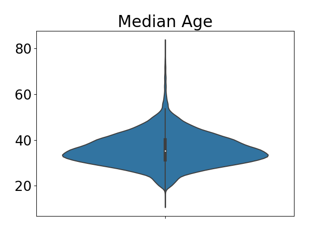

# Predicting Bad Habits: US Census Bureau
Capstone 1 for Galvanize Data Immersive

By Danny Lumian, PhD

October, 2018

## Question
    
Bad habits (i.e., binge-drinking, smoking and sleeping <7 hrs a night) 
significantly impact personal well-being and put an increased burden on society 
(e.g., by increasing health-care costs, impaired working). 
Therefore it is important to understand factors contribute to bad habits 
or, conversely, what predicts healthy living. 

Can demographic variables, such as gender, age and geographical location, predict bad habits?

## The Data

### 500 Cities: 
    The Center for Disease Control collected data from 500 cities (https://www.cdc.gov/500cities/) 
    across the US broken down by census tract (28,000+) on disease risk factors, 
    health outcomes and preventive services collected in 2015.  
    The disease risk factors, or bad habits, as defined by the CDC 
    (https://www.cdc.gov/500cities/definitions/unhealthy-behaviors.htm) are:

        __Binge drinking__:

            Adults aged ≥18 years who report having five or more drinks (men) or four or more drinks (women) on an occasion in the past 30 days.

        __Current smoking__:

            Respondents aged ≥18 years who report having smoked ≥100 cigarettes in their lifetime and currently smoke every day or some days.

        __Sleep < 7 hrs a night__:

            Respondents aged ≥18 years who report usually getting insufficient sleep (<7 hours for those aged ≥18 years, on average, during a 24-hour period).

### American Community Survey-5 year estimates(ACS5): 
    The US Census Bureau collected 5 year estimates on demographic variables 
    (https://www.census.gov/programs-surveys/acs/technical-documentation/table-and-geography-changes/2015/5-year.html) 
    accessible by census tract ID (for joining with 500 Cities data). 
    This dataset includes 1000s of variables (see: https://api.census.gov/data/2015/acs5/variables.html). 
    From these I started by pulling variables on age, gender, income, education,
    commute time, work departure time and insurance coverage as predictors of bad habits. 

## MVP
    1. Combine data from 500 Cities and the ACS5 by census tract to yield data on 25,000+ geographic regions.
    2. Explore demographic and regional (i.e. state) predictors of bad habits. 
    3. Conduct regression analyses to quantify the relative contributions of these factors.

### ACS5 Demographic Variables

#### Total Sample Size

|   Binge Drinking |   Smoking |   Sleep < 7hrs |
|-----------------:|----------:|---------------:|
|        28004     |   28004   |      28004     |
|        27141     |   27080   |      27137     |
|          863     |     924   |        867     |
|            3.082 |       3.3 |          3.096 |

#### Median Age

#### Demographic Variables

#### State Variables (Categorical)

#### Bad Habits

## Hypotheses 

0. The base rate of binge drinking will be above 0 (intercept>0).
1. As the median age <b>increases</b>,
    the % of the population that binge drinks will <b>decrease</b>.
2. As the % of the population that is female <b>increases</b>, 
    the % of the population that binge drinks will <b>decrease</b>.
3. As the % of the population with less than a high school education <b>increases</b>,
    the % of the population that binge drinks will <b>increase</b>. 
4. As the % of the population with an income to poverty ratio of less than 1.5 <b>increases</b>,
    the % of the population that binge drinks will <b>decrease</b>.
5. As the % of the population with a commute less than 30 minutes <b>increases</b>,
    the % of the population that binge drinks will <b>decrease</b>.  
6. As the % of the population that departs for work before 8am <b>increases</b>,
    the % of the population that binge drinks will <b>decrease</b>.
7. As the % of the population with insurance <b>increases</b>,
    the % of the population that binge drinks will <b>decrease</b>.
8. State will be associated with binge drinking,
    no directional hypotheses.   

